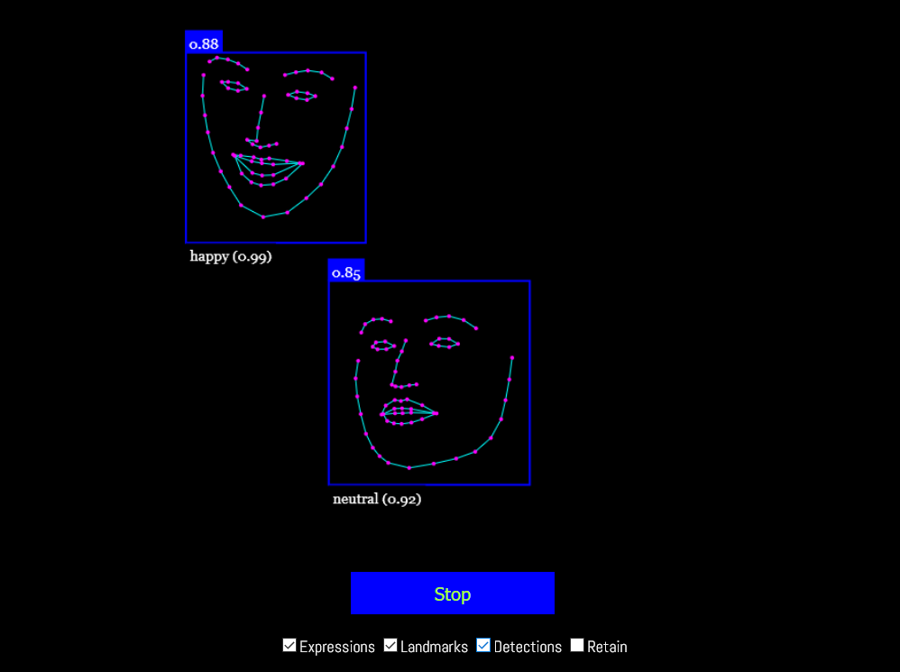

# Floating Face Terror

Fun with face recognition in the browser, using face-api.js

Check out the [live version](https://linomp.github.io/floating-face-terror/).

To run locally, open root folder in VS Code and open `index.html` with `LiveServer`.

## Sources
- Code is based on: https://youtu.be/CVClHLwv-4I
  - Note: In this video, the `startVideo` function inside `script.js` is slightly outdated. Watch until minute 5:50, then refer back to this repo for the fixed `startVideo` function. Everything else is fine. 

- [How to download and use face-api.js library](https://itnext.io/face-api-js-javascript-api-for-face-recognition-in-the-browser-with-tensorflow-js-bcc2a6c4cf07)

- [`MediaDevices.getUserMedia` documentation](https://developer.mozilla.org/es/docs/Web/API/MediaDevices/getUserMedia)
